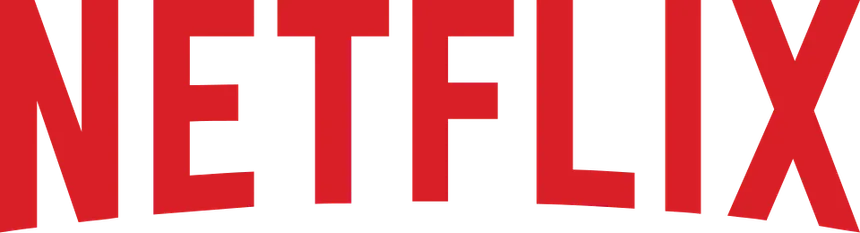

# Netflix Clone

Uma réplica visual da página de entrada (landing page) da Netflix, focada em design responsivo, performance e experiência do usuário premium.



## 🚀 Funcionalidades

- **Design Responsivo**: Adaptado para mobile, tablet e desktop.
- **Preloader Premium**: Tela de carregamento com animação de pulso e spinner no estilo Netflix.
- **Otimização de Performance**:
  - `Lazy Loading` em todas as imagens abaixo da dobra.
  - `Fetch Priority` alta para o logo principal (LCP).
  - `Preload Metadata` em vídeos de background para economizar banda.
- **Accordion FAQ**: Seção de perguntas frequentes interativa.
- **Validação de Formulário**: Sistema de validação de email com feedback visual em tempo real.

## 🛠️ Tecnologias Utilizadas

- **HTML5**: Estrutura semântica.
- **CSS3**: Estilização moderna com CSS Variables (Mobile First).
- **JavaScript (Vanilla)**: Lógica de interatividade e otimizações.

## 📦 Como Executar o Projeto

1. Clone o repositório:
   ```bash
   git clone https://github.com/seu-usuario/clone-netflix.git
   ```
2. Navegue até a pasta do projeto:
   ```bash
   cd clone-netflix
   ```
3. Abra o arquivo `index.html` em seu navegador ou use uma extensão como "Live Server" no VS Code.

## 📄 Licença

Este projeto está sob a licença MIT. Veja o arquivo [LICENSE](LICENSE) para mais detalhes.

